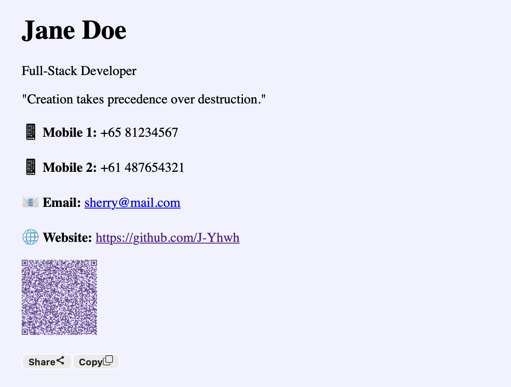

# Digital_Namecard

Interactive digital name card with vCard QR code & share — built with Vue 3, TypeScript, Vite & Tailwind.
This template should help get you started developing with Vue 3 in Vite.



**Live Demo:** (add Vercel/Netlify link when deployed)

**Features:**
- vCard format auto-save to phone contacts via QR
- Native share button (iOS/Android)
- Clipboard fallback
- Responsive & modern design (Vue 3 + TypeScript + Vite + Tailwind)


Tech stack: Vue 3, TypeScript, Vite, Tailwind CSS, QRCode.vue, @vueuse/core


## Recommended IDE Setup

[VS Code](https://code.visualstudio.com/) + [Vue (Official)](https://marketplace.visualstudio.com/items?itemName=Vue.volar) (and disable Vetur).

## Recommended Browser Setup

- Chromium-based browsers (Chrome, Edge, Brave, etc.):
  - [Vue.js devtools](https://chromewebstore.google.com/detail/vuejs-devtools/nhdogjmejiglipccpnnnanhbledajbpd)
  - [Turn on Custom Object Formatter in Chrome DevTools](http://bit.ly/object-formatters)
- Firefox:
  - [Vue.js devtools](https://addons.mozilla.org/en-US/firefox/addon/vue-js-devtools/)
  - [Turn on Custom Object Formatter in Firefox DevTools](https://fxdx.dev/firefox-devtools-custom-object-formatters/)

## Customize configuration

See [Vite Configuration Reference](https://vite.dev/config/).

## Project Setup

```sh
npm install
```

### Compile and Hot-Reload for Development

```sh
npm run dev
```

### Compile and Minify for Production

```sh
npm run build
```


